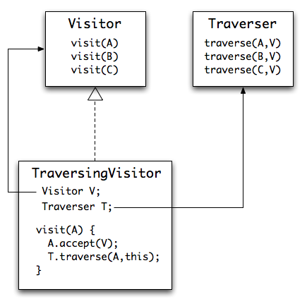
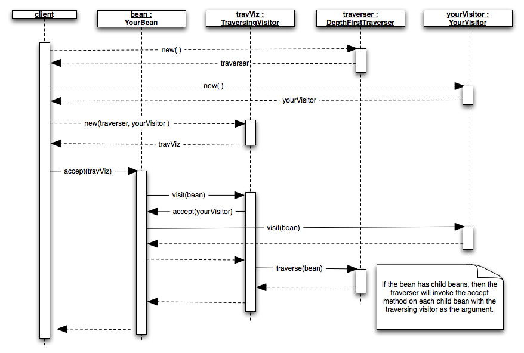

jaxb-visitor
============
 
What it does
------------
 
This plugin adds the visitor pattern that includes all of the JAXB objects 
produced by the xjc compiler. The plugin produces the following changes in the beans:
 
* add accept(Visitor) to each bean that invokes appropriate method on Visitor interface
* create Visitor interface with visit method for each bean
* create Traverser interface for traversing the graph with a Visitor
* create DepthFirstTraverser class as a sample implementation of performing a depth first traversal of the graph
* create BaseVisitor class with no-op methods for each visit as a suitable base class for providing your own operations
* create TraversingVisitor that has a Visitor and Traverser and performs a traversing visit on all nodes in the graph
* create TraversingVisitorProgressMonitor to get callbacks when a bean is visited and traversed 
 
Changes in 2.0
--------------

Version 2.0 of the plugin changed the code generator to produce a Visitor and 
supporting classes that have a return type and an Exception on each visit method.

Visitor Pattern
---------------
The standard [Visitor Pattern](http://en.wikipedia.org/wiki/Visitor_pattern) provides a way to perform an operation on the elements 
of an object structure without changing the code for the object on which it 
operates (see [Gang of Four](http://en.wikipedia.org/wiki/Design_Patterns)).

### Traversal

In many cases, the user wishes to traverse the entire object graph during a visit. 
The implementation of the graph traversal is typically done either in the accept 
method of the element being traversed or the implementation of the visitor. When 
implemented in the accept method, the order of the traversal is fixed for all 
visitor applications and traversal always occurs when visiting. When implemented 
within the visitor class, the visitor is in control of the traversal order and 
whether or not to traverse, but the actual traversal logic is typically repeated 
across all visitor implementations.

There are two goals for this visitor implementation that make the previous two 
options for traversal undesirable:

- The traversal of the full graph is not always required
- The order and depth of the traversal must be easily configurable 

In order to address these requirements, the implementation of the graph traversal 
is externalized into its own interface. An implementation of the Traverser interface 
provides a single traverse method for each bean that allows the implementation to 
visit some or all of the child nodes in whatever order desired by the Traverser. 
This modular approach leads to a great deal of flexibility in the configuration 
of visitors and traversal.

The result of the externalization is that a Visitor implementation can address 
single nodes without traversing or work with a Traverser to visit the entire graph. 
The plugin generates a few classes to help provide the user a starting point in 
their implementations.

| Class         | Description   | 
| ------------- | :-------------:| 
| DepthFirstTraverser | Implementation of the Traverser interface that traverses all of the children in a depth first order | 
| TraversingVisitor      | Implementation of the Visitor interface that contains a delegate Visitor for its operation and a Traverser to traverse the graph. | 
| TraversingVisitorProgressMonitor | Interface that receives callbacks when a node is visisted or traversed. Useful if you're maintaing a stack and pushing/popping nodes | 

 	
### Visitor Diagram

The UML diagrams below show the basic layout (minus the TraversingVisitorProgressMonitor) 

### Sequence Diagram

The Sequence diagram showing the creation of a TraversingVisitor?. This only 
shows the interaction with a single bean. If the simple bean shown has child 
beans, then each of those beans would be visited during the traversal. 

Configuration
-------------

jaxb-visitor is now in Maven Central. You only need to configure the dependency below in your pom:

       <dependency>
          <groupId>com.massfords</groupId>
          <artifactId>jaxb-visitor</artifactId>
          <version>2.7</version>
       </dependency>

| Command Line Argument | Description   | 
| ------------- | :-------------:| 
| -Xvisitor | Main option name that triggers the plugin's behavior | 
| -Xvisitor-package:com.your.package.name | Tells the plugin which package to use for the generated code. If not specified, defaults to first package encountered during codegen | 
| -Xvisitor-includeType | Changes the default code generator for the visitor and traverse to avoid overloading and instead include the type name. This is in response to Issue #8 where very large schemas resulted in a large number of overloaded methods which can be a performance issue. | 
| -Xvisitor-noClasses | Skips the generation of classes. The plugin will only generate interfaces and modify the beans to support the visitor pattern. | 

 	
### maven-jaxb2-plugin Sample

          <plugin>
              <groupId>org.jvnet.jaxb2.maven2</groupId>
              <artifactId>maven-jaxb2-plugin</artifactId>
              <version>0.8.2</version>
              <executions>
                  <execution>
                      <goals>
                          <goal>generate</goal>
                      </goals>
                  </execution>
              </executions>
              <configuration>
                  <strict>false</strict>
                  <extension>true</extension>

                  <schemaDirectory>
                      ${basedir}/src/main/resources
                  </schemaDirectory>

                  <schemaIncludes>
                      <value>ws-humantask.xsd</value>
                  </schemaIncludes>

                  <args>
                     <arg>-Xvisitor</arg>
                    <arg>-Xvisitor-package:com.massfords.humantask</arg>
                  </args>

                  <plugins>
                      <plugin>
                         <groupId>com.massfords</groupId>
                         <artifactId>jaxb-visitor</artifactId>
                         <version>2.7</version>
                      </plugin>
                  </plugins>
              </configuration>
          </plugin>

### cxf-codegen-plugin Sample

         <plugin>
            <groupId>org.apache.cxf</groupId>
            <artifactId>cxf-codegen-plugin</artifactId>
            <version>2.2.6</version>
            <dependencies>
               <dependency>
                  <groupId>com.massfords</groupId>
                  <artifactId>jaxb-visitor</artifactId>
                  <version>2.7</version>
               </dependency>
            </dependencies>
            <executions>
               <execution>
                  <id>generate-sources</id>
                  <configuration>
                     <defaultOptions>
                        <extraargs>
                           <extraarg>-xjc-Xvisitor</extraarg>
                           <extraarg>-xjc-Xvisitor-package:com.massfords.humantask</extraarg>
                        </extraargs>
                     </defaultOptions>
                     <wsdlOptions>
                        <wsdlOption>
                           <wsdl>${basedir}/src/main/resources/ws-humantask-api.wsdl</wsdl>
                        </wsdlOption>
                     </wsdlOptions>
                  </configuration>
                  <goals>
                     <goal>wsdl2java</goal>
                  </goals>
               </execution>
            </executions>
         </plugin>

### org.codehaus.mojo:jaxb2-maven-plugin Sample

        <plugin>
          <groupId>org.codehaus.mojo</groupId>
          <artifactId>jaxb2-maven-plugin</artifactId>
          <configuration>
            <arguments>-Xvisitor -Xvisitor-package:com.massfords.humantask</arguments>
          </configuration>
          <dependencies>
            <dependency>
              <groupId>com.massfords</groupId>
              <artifactId>jaxb-visitor</artifactId>
              <version>2.7</version>
            </dependency>
          </dependencies>
          <executions>
            <execution>
              <id>xjc</id>
              <goals>
                <goal>xjc</goal>
              </goals>
            </execution>
          </executions>
        </plugin>

Sample Projects
===============

If you are using the plugin in your project and you are able to share your schema 
then please feel free to add a comment here and I'll add a link or some 
documentation describing your project.

[calc-viz](https://github.com/massfords/calcviz)

JAXBElement Behavior
====================

The JAXB tutorial suggests modifying your schema to avoid having JAXBElement<?> types. 
The problem with the JAXBElement wrapper is that you don't have a distinct class 
for the top level type which makes visiting and traversing difficult.

Use Simple Binding
------------------

The simple binding may help reduce some of the JAXBElement generation.
Example Schema with JAXBElements

       <xsd:element name="comparisonOps"
                    type="fes:ComparisonOpsType"
                    abstract="true"/>
       <xsd:complexType name="ComparisonOpsType" abstract="true"/>
    
       <xsd:element name="PropertyIsEqualTo"
                    type="fes:BinaryComparisonOpType"
                    substitutionGroup="fes:comparisonOps"/>
       <xsd:element name="PropertyIsNotEqualTo"
                    type="fes:BinaryComparisonOpType"
                    substitutionGroup="fes:comparisonOps"/>
    
       <xsd:element name="PropertyIsLike"
                    type="fes:PropertyIsLikeType"
                    substitutionGroup="fes:comparisonOps"/>
       <xsd:element name="PropertyIsNull"
                    type="fes:PropertyIsNullType"
                    substitutionGroup="fes:comparisonOps"/>
       <xsd:element name="PropertyIsNil"
                    type="fes:PropertyIsNilType"
                    substitutionGroup="fes:comparisonOps"/>
       <xsd:element name="PropertyIsBetween"
                    type="fes:PropertyIsBetweenType"
                    substitutionGroup="fes:comparisonOps"/>

The schema snippet above is from the OGC schema. You can provide a filter where 
you specify a property/value with one of the following operators:
 
        (=, !=, >, >=, <, <=, LIKE, NULL, NIL, BETWEEN).

Note that the elements for some of these operators (LIKE, NULL, NIL, BETWEEN) all 
have custom types, while the other operators all derive from BinaryComparisonOpType.

The result is that the JAXB for the comparison type looks like this:

        @XmlAccessorType(XmlAccessType.FIELD)
        @XmlType(name = "ComparisonOpsType")
        @XmlSeeAlso({
            BinaryComparisonOpType.class,
            PropertyIsNilType.class,
            PropertyIsBetweenType.class,
            PropertyIsNullType.class,
            PropertyIsLikeType.class
        })

Note that we don't get top level classes for PropertyIsEqual, etc since they are 
all folded into BinaryComparisonOpType.

If you owned the schema, you would create custom types as the tutorial link at 
the top suggests but that's not always possible.

The result in this case is that the Visitor plugin will unwrap the JAXBElement 
value during its traversal and visiting. The drawback here is that the semantics 
of the element which are encoded in its name are not readily available in the 
visit method. Consider the case of the BinaryComparisonOpType? above. The visit 
method could be working with any of the following operators: 

        =, !=, >, >=, <, <=.

1.13+ handling
--------------

An additional step in the VisitorPlugin? adds a QName to beans that are wrapped 
within a JAXBElement. This field is automatically set via an Unmarshaller 
callback event. This QName can be used during a visit to check on the instance's 
name and therefore determine what the semantics are for the bean.

The snippet below illustrates how a visitor can check the QName while visiting a 
wrapped bean. Note that this assumes that the bean has been unmarshalled. There 
currently isn't a mechanism in place to set the QName apart from the Unmarshaller 
Listener.

        TraversingVisitor tv = new TraversingVisitor(new DepthFirstTraverserImpl(), new BaseVisitor() {
                    @Override
                    public void visit(BinaryComparisonOpType bean) {
                        if ("PropertyIsEqualTo".equals(
                               bean.getJAXBElementName().getLocalPart())) {
                           // behavior for equals
                        }
                    }
                });

1.12 handling
-------------

The generated visitor and traversal classes do not address this issue. One 
workaround here is that the implementor could store the name during the traversal.

Current Approach
----------------

The DepthFirstTraverserImpl? generated by the plugin is the class most affected 
by JAXBElements. When examining a generated bean, this portion of the code 
generator must consider all of the child beans in the object and whether and how 
to traverse them. Child properties that manifest as simple type elements or 
attributes are not traversed. Only values that are themselves generated beans get 
traversed.

The decision for whether to traverse a any element is made by examining its type.

| Type | Traversal Code | 
| ------------- | :-------------:| 
| SomeGeneratedBean	| null check required but no cast since the generated bean will implement Visitable | 
| SomeSimpleType | no traversal since simple types are not Visitable | 
| Collection of SomeGeneratedBean | for each bean, null check required but no cast since the generated bean will implement Visitable | 
| Collection of SomeSimpleType | no traversal since simple types are not Visitable | 
| Collection of ? extends Object | for each bean check for instanceof Visitable and traverse if it is | 
| JAXBElement of SomeGeneratedBean | check element for not null and traverse its value if available | 
| JAXBElement of ? extends Object | check element for not null and its value for instanceof Visitable and traverse if it is | 

