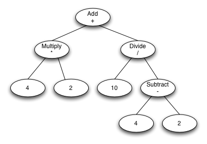
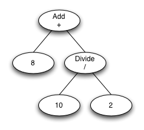
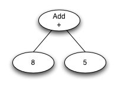
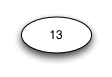

# calcviz

The calcviz project is an example of how to use the jaxb-visitor plugin. The schema defines 
simple binary and unary math operations and enables the construction of an 
expression graph. Sample visitors are provided to demonstrate a few different 
operations. 

The image above shows a simple graph using the schema provided in the project. 
This is a toy example, but it allows us to consider a number of operations that 
we might want to perform on this graph. The most obvious operation is evaluating 
the graph in order to produce a result. This involves visiting each of the nodes 
and evaluating its child nodes so that we have the input for the node's 
operation. Another operation might be to serialize the graph to a string so it 
can be represented in a compact form. Other operations might be static analysis, 
simplification, partial evaluation, etc.

The table below lists the visitors that are implemented in the calcviz project: 

| Visitor                     |                                       Description                                        | 
|-----------------------------|:----------------------------------------------------------------------------------------:|
| CalculatorVisitor           |                                 Evaluates the expression                                 | 
| ExpressionSerializerVisitor |                            Serializes the graph to a string.                             | 
| PartialEvaluatorVisitor     | Transforms the graph by evaluating any of the operations that contain literal arguments. | 

### Results

The results of the visitor varies based on the operation it's performing. The 
CalculatorVisitor and ExpressionSerializerVisitor are designed to visit the 
graph once and produce a result. The PartialEvaluatorVisitor modifies the graph 
and is designed to run multiple times until the graph is in its simplest form. 
In a sense it performs a step by step evaluation which may help illustrate how 
the expression is evaluated.

| Visitor                      |                Output                | 
|------------------------------|:------------------------------------:|
| CalculatorVisitor	           |                 13.0                 | 
| ExpressionSerializerVisitor	 | ((4.0 * 2.0) + (10.0 / (4.0 - 2.0))) | 
| PartialEvaluatorVisitor	     |    modified graph as shown below     | 

### PartialEvaluatorVisitor Output	

#### First Visit

#### Second Visit

#### Third Visit

